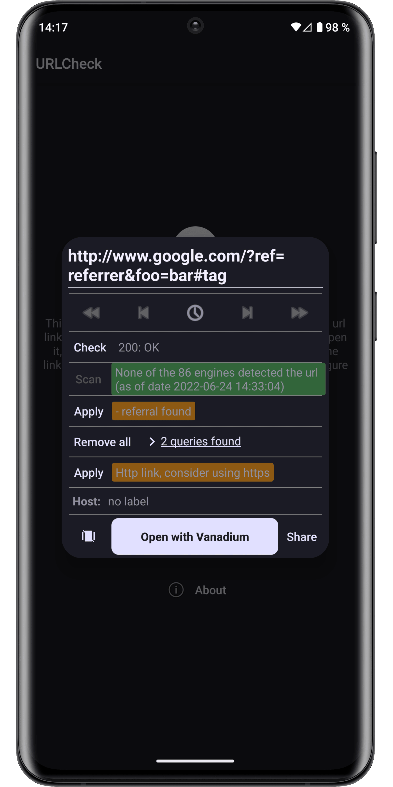
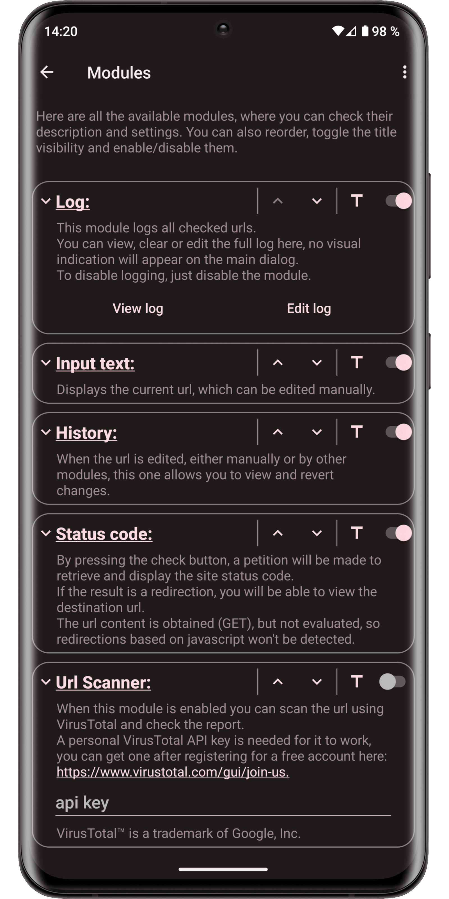
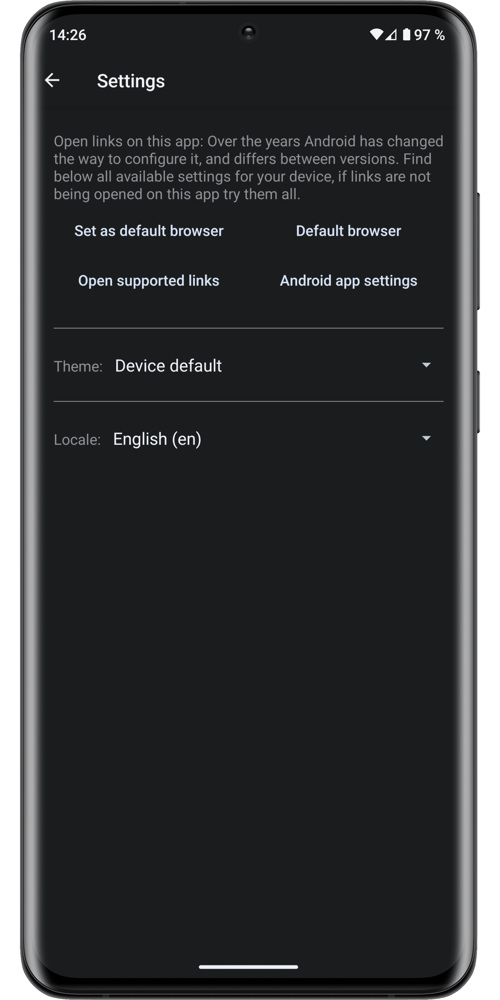

<!-- ---------- Header ---------- -->

<!-- Original background with CC0 from https://www.maxpixel.net/Digital-Network-Internet-Communication-Connections-3537400 -->

<!-- title -->

# URLCheck

<!-- ---------- Badges ---------- -->

[%5B%27%22%5D&replace=v%241&label=development%20version&color=darkgrey)](https://github.com/TrianguloY/URLCheck/blob/master/app/build.gradle)

<!-- ---------- Download ---------- -->

[](https://apps.obtainium.imranr.dev/redirect?r=obtainium://app/%7B%22id%22%3A%22com.trianguloy.urlchecker%22%2C%22url%22%3A%22https%3A%2F%2Fgithub.com%2FTrianguloY%2FURLCheck%22%2C%22author%22%3A%22TrianguloY%22%2C%22name%22%3A%22URLCheck%22%2C%22preferredApkIndex%22%3A0%2C%22additionalSettings%22%3A%22%7B%5C%22includePrereleases%5C%22%3Afalse%2C%5C%22fallbackToOlderReleases%5C%22%3Atrue%2C%5C%22filterReleaseTitlesByRegEx%5C%22%3A%5C%22%5C%22%2C%5C%22filterReleaseNotesByRegEx%5C%22%3A%5C%22%5C%22%2C%5C%22verifyLatestTag%5C%22%3Afalse%2C%5C%22dontSortReleasesList%5C%22%3Afalse%2C%5C%22useLatestAssetDateAsReleaseDate%5C%22%3Afalse%2C%5C%22releaseTitleAsVersion%5C%22%3Afalse%2C%5C%22trackOnly%5C%22%3Afalse%2C%5C%22versionExtractionRegEx%5C%22%3A%5C%22%5C%22%2C%5C%22matchGroupToUse%5C%22%3A%5C%22%5C%22%2C%5C%22versionDetection%5C%22%3Atrue%2C%5C%22releaseDateAsVersion%5C%22%3Afalse%2C%5C%22useVersionCodeAsOSVersion%5C%22%3Afalse%2C%5C%22apkFilterRegEx%5C%22%3A%5C%22%5C%22%2C%5C%22invertAPKFilter%5C%22%3Afalse%2C%5C%22autoApkFilterByArch%5C%22%3Atrue%2C%5C%22appName%5C%22%3A%5C%22%5C%22%2C%5C%22shizukuPretendToBeGooglePlay%5C%22%3Afalse%2C%5C%22allowInsecure%5C%22%3Afalse%2C%5C%22exemptFromBackgroundUpdates%5C%22%3Afalse%2C%5C%22skipUpdateNotifications%5C%22%3Afalse%2C%5C%22about%5C%22%3A%5C%22%5C%22%2C%5C%22refreshBeforeDownload%5C%22%3Afalse%7D%22%2C%22overrideSource%22%3Anull%7D)

Apk details

App package: `com.trianguloy.urlchecker`

SHA-256 Hash of Signing Certificate:\
Play Store: `F9:A2:D8:D8:94:FA:FE:A1:4C:F6:05:C4:D7:22:AF:D0:49:4D:69:41:1F:60:6A:AA:0B:B1:F2:85:E7:A9:A6:60`\
F-Droid: `93:D7:9B:1E:72:D5:A6:B0:BC:68:11:B9:BC:0A:83:18:1C:35:10:D5:8C:11:57:11:40:FF:3F:8A:63:F2:21:74`\
GitHub/Obtainium/IzzyOnDroid: `BF:1B:69:C1:4D:A2:42:0C:A7:20:11:F7:2C:F4:83:74:58:EC:5D:3C:C4:B5:38:24:34:37:BC:17:C1:92:01:C6`

Note: All three different versions (Play Store, F-droid and Github) are signed with different certificates, so you cannot update one with another unless you uninstall first.\
Remember to use the backup/restore functionality to migrate your data!

<!-- contributors -->

### Android app made by [TrianguloY](https://github.com/TrianguloY)

Special contributors: [Ilithy](https://github.com/Ilithy), [PabloOQ](https://github.com/PabloOQ), [anoop-b](https://github.com/anoop-b)

All contributors: \
 \
and [404potato](https://github.com/404potato) and maybe some more from [Weblate](https://hosted.weblate.org/engage/urlcheck/).

<!-- ---------- Description ---------- -->
**URLCheck** acts as an amazingly customizable and powerful intermediary when opening url links, allowing, among other things:
to remove trackers, affiliate links, unnecessary elements, check Hosts, facilitating link holding and sharing, protecting against certain phishing techniques and many more...

<!-- ---------- Screenshots ---------- -->

  
  
  
  
  
  
  
  

<!-- ---------- Trademarks ---------- -->

Uses:

- [VirusTotal](https://www.virustotal.com/gui/)™ is a trademark of Google, Inc
- Built-in catalog copied from [ClearURLs](https://docs.clearurls.xyz/latest/specs/rules)
- [unshorten.me](https://unshorten.me/) free API by Unshorten.me
- [StevenBlack's Hosts](https://github.com/StevenBlack/hosts)

<!-- ---------- Contribution & contributors ---------- -->

## Contribution

**All help is greatly welcomed!**  
Feel free to [**suggest changes**](https://github.com/TrianguloY/URLCheck/issues/new), request a [**new feature**](https://github.com/TrianguloY/URLCheck/issues/new?assignees=&labels=enhancement&template=feature_request.md&title=), create [**bug report**](https://github.com/TrianguloY/URLCheck/issues/new?assignees=&labels=bug&template=bug_report.md&title=) or even [**pull request**](https://help.github.com/articles/about-pull-requests/). _(from a simple typo fix to a full new module or even more!)_  
**Translations are also greatly appreciated.**

See [CONTRIBUTING](docs/CONTRIBUTING.md) for code or translation details and tips.

<a href="https://star-history.com/#TrianguloY/URLCheck&Date">
 <picture>
   <source media="(prefers-color-scheme: dark)" srcset="https://api.star-history.com/svg?repos=TrianguloY/URLCheck&type=Date&theme=dark" />
   <source media="(prefers-color-scheme: light)" srcset="https://api.star-history.com/svg?repos=TrianguloY/URLCheck&type=Date" />
   
 </picture>
</a>

<!-- ---------- License ---------- -->

## License

You can use parts of this project in your own ones, or upload modified versions of it AS LONG AS you credit me.

**How to credit:**

- You must add my nick [**TrianguloY**](https://github.com/TrianguloY/) in an `about` or `acknowledgments` section visible to the user.
- You must add a link to this [**GitHub main page**](https://github.com/TrianguloY/URLCheck) or subpage (if you used a part of the code or an asset) in an `about` or `acknowledgments` section visible to the user.
