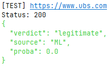
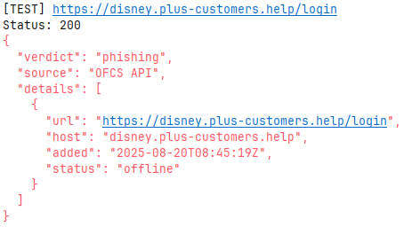

# PoC – Analyse des liens (`link_analysis`)

Ce module Python constitue le **cœur de l’analyse des URLs** dans le projet `seal_phishing`.  
Il fournit une **API REST (FastAPI)** permettant de classifier des liens comme **légitimes**, **suspects** ou **malveillants** à l’aide de plusieurs techniques combinées :

- **Bases de données externes** : Google Safe Browsing, OFCS (PhishDB), URLhaus  
- **Modèle de machine learning (Random Forest)** entraîné localement sur un dataset d’URLs réelles

---

## Fonctionnalités principales

- API FastAPI exposant un endpoint `/check_url`
- Appels automatiques à plusieurs bases de données de sécurité
- Classification automatique via un modèle de machine learning
- Extraction d’attributs d’URLs pour l’analyse heuristique
- Script de tests automatisés sur un jeu d’URLs de test (phishing / légitimes)
- Gestion robuste des clés API (analyse ML exécutée même sans clés)

---

## Prérequis

1. **Python 3.10+**  
2. **Installation des dépendances** :

```bash
  pip install -r requirements.txt
````

3. **Création du fichier `.env`** dans `link_analysis/` (ou à la racine du projet) :

Copiez le modèle fourni :

```bash
  cp link_analysis/.env.example link_analysis/.env
```

Puis éditez le fichier `.env` pour y renseigner vos clés :

```
GOOGLE_API_KEY=VOTRE_CLÉ_GOOGLE
OFCS_API_KEY=VOTRE_CLÉ_OFCS
URLHAUS_API_KEY=VOTRE_CLÉ_URLHAUS
```

**Remarques importantes :**

* La clé **OFCS** est **difficile à obtenir** (réservée à certains partenaires).
  Si vous n’en avez pas, **ce n’est pas bloquant** : la vérification OFCS sera simplement ignorée.
* La clé **URLhaus** peut être obtenue gratuitement via URLhaus.
* La clé **Google Safe Browsing** peut être obtenue gratuitement via Google Cloud Console.

---

## Entraînement du modèle (obligatoire)

Le modèle n’est pas versionné. Vous devez d’abord **construire le dataset**, puis **entraîner** le modèle.

1) Générer le dataset à partir des sources :
```bash
  python link_analysis/scripts/build_dataset.py
````

2. Entraîner le modèle Random Forest :

```bash
  python link_analysis/analysis/ml_model.py
```

Le modèle sera enregistré dans `link_analysis/analysis/ml/model.joblib`,
basé sur les données du fichier `database/dataset_final.csv`.

---

## Lancement de l’API

Depuis la racine du projet :

```bash
  uvicorn link_analysis.main:app --host 127.0.0.1 --port 8001
```

L’API sera disponible à l’adresse :
[http://127.0.0.1:8001](http://127.0.0.1:8001)

Interface interactive Swagger :
[http://127.0.0.1:8001/docs](http://127.0.0.1:8001/docs)

---

## Tester l’API

Un script de test est fourni dans `link_analysis/tests/test_api.py`.
Il envoie une série d’URLs de test à l’API et affiche les résultats colorés selon le verdict (**phishing**, **suspect**, **legitimate**).

### Lancer les tests

Ouvre **deux terminaux** :

**Terminal 1** – démarre le serveur :

```bash
  uvicorn link_analysis.main:app --port 8001 --reload
```

**Terminal 2** – exécute les tests :

```bash
  python link_analysis/tests/test_api.py
```

---

## Résultat attendu

Pour chaque URL testée, la console affiche :

* L’URL analysée
* ⚙Le code de réponse HTTP de l’API
* Le verdict (`phishing` / `suspect` / `legitimate`)
* La **source** de la détection (ex. `OFCS`, `Google Safe Browsing`, `URLhaus`, ou `ML`)

Les clés absentes (OFCS, Google, etc.) sont signalées proprement :

> `[OFCS] Clé API absente — vérification OFCS ignorée.`

Le modèle ML prend automatiquement le relais.

---

## Exemple de réponses JSON

### Exemple 1 — Détection par modèle ML



### Exemple 2 — Détection via base OFCS



---

## Résumé

| Élément             | Optionnel ? | Description                                    |
| ------------------- |-------------|------------------------------------------------|
| **OFCS_API_KEY**    | Oui         | Vérification PhishDB suisse (accès restreint)  |
| **GOOGLE_API_KEY**  | Oui         | Vérification Safe Browsing Google              |
| **URLHAUS_API_KEY** | Oui         | Vérification via abuse.ch                      |
| **Modèle ML**       | Non         | À générer localement via les scripts fournis   |
| **Fichier `.env`**  | Non         | Contient vos clés locales (jamais à committer) |
